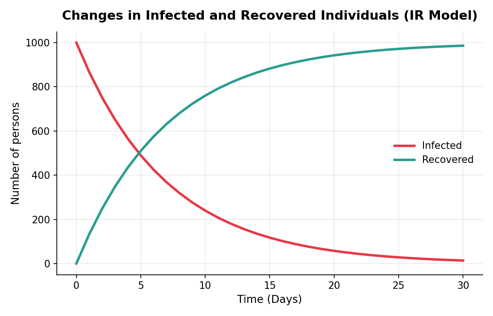
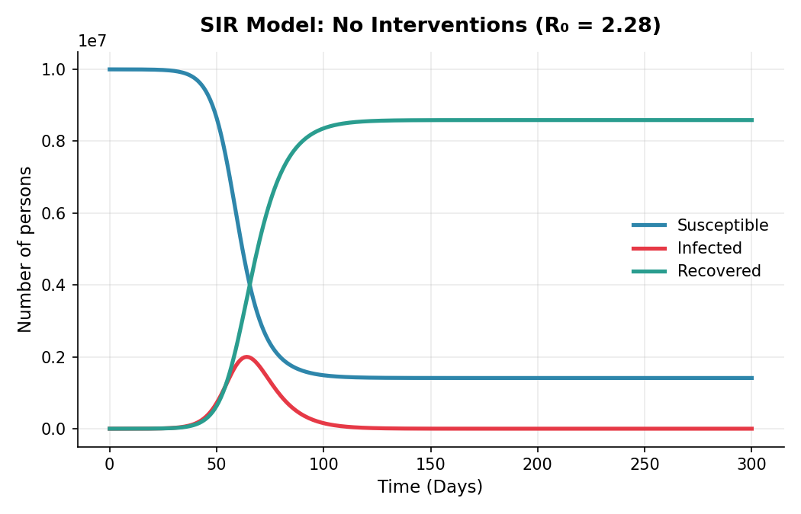
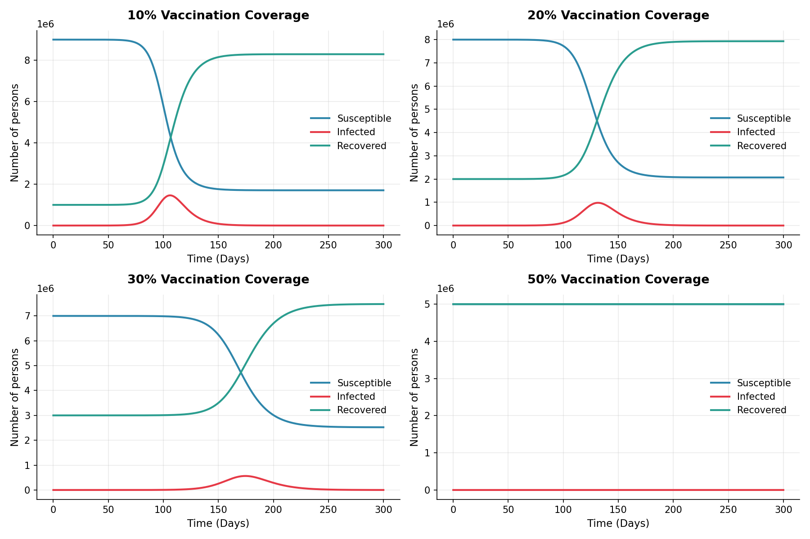
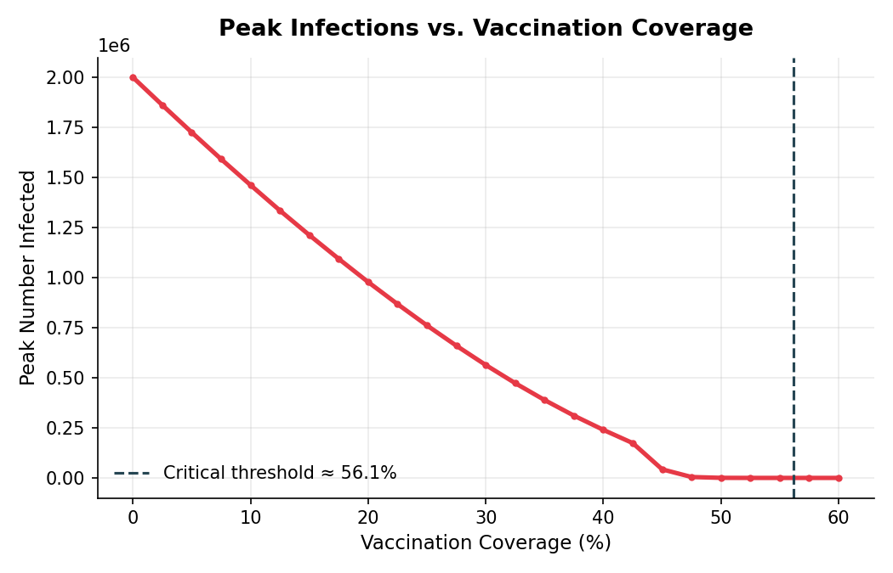

#  Mathematical Disease Modelling in R

**Deterministic compartmental models (IR & SIR) for infectious disease dynamics, built from first principles in R.**

[](https://www.r-project.org/)
[](https://cran.r-project.org/package=deSolve)
[](https://www.tidyverse.org/)
[](LICENSE)
[](#)

> Part of the **Mathematical Modeling and Simulation** coursework. This repository walks through the construction of deterministic epidemic models — starting from a simple two-compartment Infected–Recovered (IR) model and building up to a full Susceptible–Infected–Recovered (SIR) model with vaccination interventions and critical vaccination threshold analysis.

---

## Table of Contents

- [Overview](#-overview)
- [Why Deterministic Models?](#-why-deterministic-models)
- [Modelling Framework](#-modelling-framework)
- [Repository Structure](#-repository-structure)
- [Models Covered](#-models-covered)
  - [1. IR Model](#1-ir-model-infected--recovered)
  - [2. SIR Model](#2-sir-model-susceptible--infected--recovered)
  - [3. SIR with Vaccination](#3-sir-model-with-vaccination)
  - [4. Critical Vaccination Threshold](#4-critical-vaccination-threshold)
- [Getting Started](#-getting-started)
- [Dependencies](#-dependencies)
- [Key Equations](#-key-equations)
- [Results at a Glance](#-results-at-a-glance)
- [Roadmap](#-roadmap)
- [References](#-references)
- [Author & License](#-author--license)

---

## Overview

Infectious disease outbreaks can be understood and forecast using **compartmental models** — mathematical frameworks that divide a population into groups (compartments) based on disease status, and describe the flow of individuals between those groups using differential equations.

This repository is a hands-on, reproducible R walkthrough that teaches the **complete workflow** of building a deterministic epidemic model, from evidence synthesis to visualization, using:

- [`deSolve`](https://cran.r-project.org/package=deSolve) to numerically solve ordinary differential equations (ODEs)
- [`tidyverse`](https://www.tidyverse.org/) for data wrangling and visualization
- [`DiagrammeR`](https://cran.r-project.org/package=DiagrammeR) to visualize compartment flow diagrams

---

## Why Deterministic Models?

Deterministic models assume that, given a fixed set of initial conditions and parameters, the model will **always produce the same output** — there is no randomness. They are the foundation of infectious disease modelling and are widely used to:

- Understand outbreak dynamics (growth, peak, decline)
- Estimate key epidemiological quantities like the **basic reproduction number (R₀)**
- Evaluate the impact of interventions (vaccination, quarantine, treatment)
- Determine **critical thresholds** needed to prevent or control an epidemic

---

## Modelling Framework

Every model in this repository follows the same five-step framework, which is good practice for any modelling exercise:

<table>
<tr><th>Step</th><th>Description</th></tr>
<tr><td><strong>1. Evidence synthesis</strong></td><td>Extract parameter values from literature or study data (e.g. duration of infectiousness, R₀)</td></tr>
<tr><td><strong>2. Model input</strong></td><td>Define initial compartment values, transition parameters, and simulation time steps</td></tr>
<tr><td><strong>3. Model construction</strong></td><td>Write the system of differential equations as an R function</td></tr>
<tr><td><strong>4. Model output</strong></td><td>Solve the ODE system using <code>deSolve::ode()</code> and return a data frame</td></tr>
<tr><td><strong>5. Exploratory analysis</strong></td><td>Reshape (tidy) and visualize the output with <code>ggplot2</code></td></tr>
</table>


---

## Repository Structure

```
.
├── 1a_Deterministic_models.Rmd     # Main R Markdown walkthrough (IR → SIR → interventions)
├── 1a_Deterministic_models.html    # Rendered HTML output (knit from the Rmd)
├── figures/                        # Exported plots used in this README
├── README.md                       # You are here
└── LICENSE
```

---

## Models Covered

### 1. IR Model (Infected → Recovered)

A closed cohort of **1,000 infected individuals**, with **no susceptible compartment**, transitions to recovery at a constant rate. Once recovered, immunity is lifelong.

<p align="center">

</p>

| Parameter | Symbol | Value |
|---|---|---|
| Initial infected | I₀ | 1,000 |
| Initial recovered | R₀ | 0 |
| Duration of infectiousness | 1/γ | 7 days |
| Recovery rate | γ | 1/7 |
| Follow-up duration | — | 30 days |

**Differential equations:**

```
dI/dt = -γI
dR/dt =  γI
```

<p align="center">

</p>

---

### 2. SIR Model (Susceptible → Infected → Recovered)

Complexity is increased by introducing a **Susceptible** compartment. The population is closed (no births/deaths), all infected individuals are infectious, and recovery confers lifelong immunity.

<p align="center">

</p>

| Parameter | Symbol | Value |
|---|---|---|
| Population size | N | 10,000,000 |
| Initial infected | I₀ | 100 |
| Initial recovered | R₀ | 0 |
| Duration of infectiousness | 1/γ | 7 days |
| Basic reproduction number | R₀ (epi) | 2.28 |
| Infection rate | β = R₀·γ | 0.3257 |
| Follow-up duration | — | 300 days |

**Differential equations:**

```
λ = βI / N
dS/dt = -λS
dI/dt =  λS - γI
dR/dt =  γI
```

<p align="center">

</p>

---

### 3. SIR Model with Vaccination

A vaccine with **100% effectiveness** is introduced. Vaccinated individuals are modelled as starting directly in the **Recovered** compartment (i.e., immune from time zero). The scenario explores **10% coverage** as an initial test case.

```
S₀ = (1 - p) × N
R₀ = p × N
```
where `p` = proportion vaccinated.

<p align="center">

</p>

---

### 4. Critical Vaccination Threshold

The **critical vaccination threshold** is the minimum proportion of the population that must be immune to prevent sustained transmission (i.e., to bring the effective reproduction number below 1). It is explored empirically by simulating coverage levels of **20%, 30%, 40%, and 50%**, and can be derived analytically as:

```
p_critical = 1 - 1/R₀
```

For R₀ = 2.28, this gives a critical vaccination threshold of **≈ 56%**.

<p align="center">

</p>

---

## Getting Started

### Clone the repository

```bash
git clone https://github.com/<your-username>/deterministic-disease-models.git
cd deterministic-disease-models
```

### Open in RStudio

```r
# Open the R Markdown file
file.edit("1a_Deterministic_models.Rmd")
```

### Knit the document

Click **Knit** in RStudio, or run:

```r
rmarkdown::render("1a_Deterministic_models.Rmd")
```

---

## Dependencies

Install the required packages before running the analysis:

```r
install.packages(c("deSolve", "tidyverse", "DiagrammeR"))
```

| Package | Purpose |
|---|---|
| `deSolve` | Solves systems of ordinary differential equations (ODEs) |
| `tidyverse` | Data manipulation (`dplyr`, `tidyr`) and visualization (`ggplot2`) |
| `DiagrammeR` | Renders Graphviz-based compartment flow diagrams |

---

## Key Equations

<table>
<tr><th>Quantity</th><th>Formula</th><th>Meaning</th></tr>
<tr><td>Force of infection</td><td><code>λ = β·I/N</code></td><td>Per-capita rate at which susceptibles become infected</td></tr>
<tr><td>Basic reproduction number</td><td><code>R₀ = β/γ</code></td><td>Average number of secondary infections from one case in a fully susceptible population</td></tr>
<tr><td>Critical vaccination threshold</td><td><code>p_c = 1 - 1/R₀</code></td><td>Minimum coverage needed to prevent an epidemic (herd immunity threshold)</td></tr>
</table>

---

## Results at a Glance

| Scenario | Peak Infected (approx.) | Epidemic Averted? |
|---|---|---|
| No vaccination | ~2.1M | ❌ No |
| 10% coverage | High, epidemic still occurs | ❌ No |
| 20% coverage | Reduced peak, epidemic still occurs | ❌ No |
| 30% coverage | Further reduced peak | ❌ No |
| 50% coverage | Small residual outbreak | ❌ No (below threshold) |
| ≥56% coverage (theoretical) | Negligible | ✅ Yes |

*(Figures are illustrative outputs from the deterministic SIR model with R₀ = 2.28; exact values depend on simulation parameters.)*

---

## Roadmap

- [ ] Add age-structured compartmental model
- [ ] Incorporate births and deaths (open population dynamics)
- [ ] Extend to vector-borne disease models (host–vector compartments)
- [ ] Parameter calibration using Maximum Log-Likelihood Estimation
- [ ] Add stochastic model comparison notebook

---

## References

- Keeling, M. J., & Rohani, P. (2008). *Modeling Infectious Diseases in Humans and Animals*. Princeton University Press.
- Soetaert, K., Petzoldt, T., & Setzer, R. W. (2010). Solving Differential Equations in R: Package deSolve. *Journal of Statistical Software*, 33(9).
- Wickham, H., et al. (2019). Welcome to the Tidyverse. *Journal of Open Source Software*, 4(43).

---

## Author & License

Developed as part of **Mathematical Modeling and Simulation** coursework.

This project is licensed under the [MIT License](LICENSE) — feel free to use, modify, and share with attribution.

---

<p align="center"><i>⭐ If you found this useful for learning epidemic modelling in R, consider starring the repo!</i></p>
